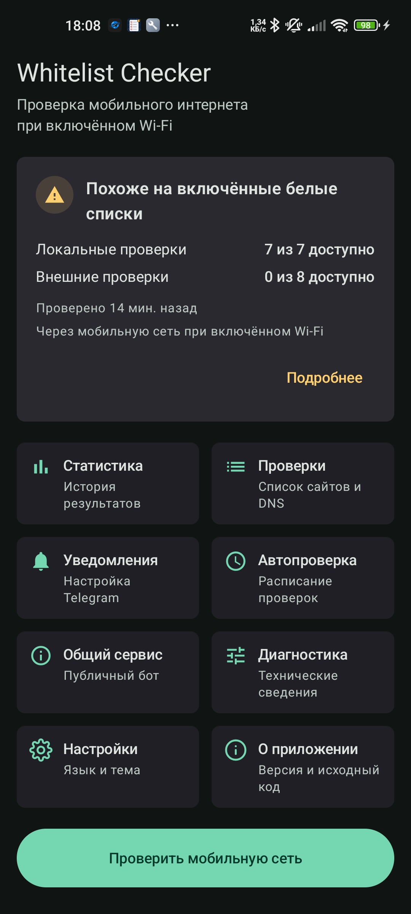
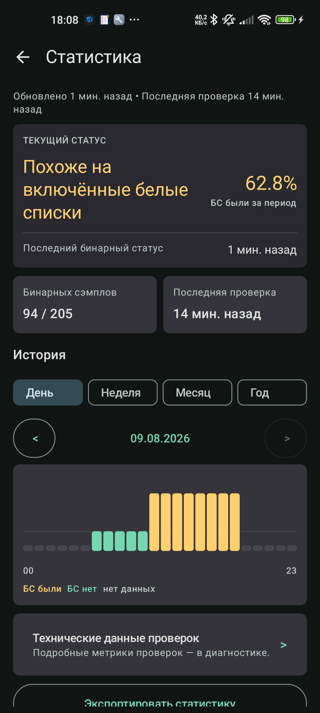
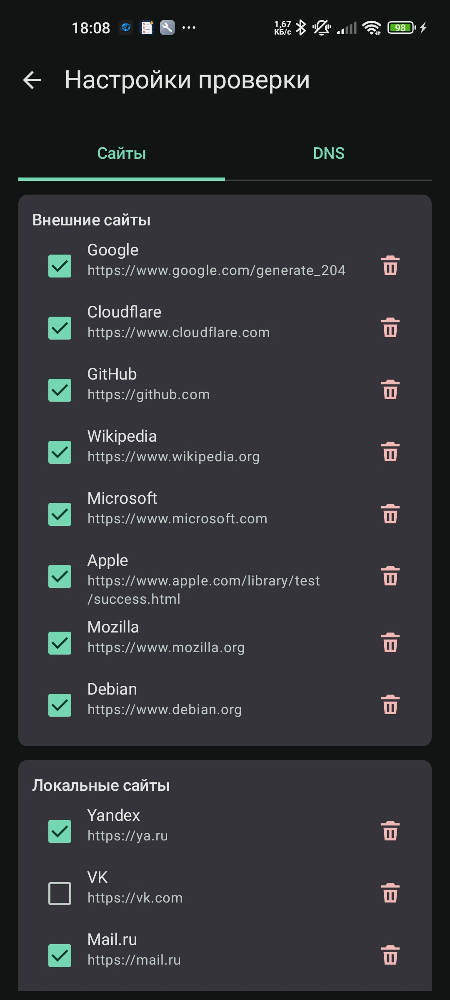

<div align="center">

# WhiteListChecker

An Android application for checking mobile-network availability and detecting signs of allowlist-only network access. Checks are routed through the cellular connection even when Wi-Fi remains the phone's active network.

[Русский](README.md) · **English**

[](https://github.com/Regstar2/WhiteListChecker/actions/workflows/android.yml)
[](https://kotlinlang.org/)
[](app/build.gradle.kts)
[](#ai-assisted-development)
[](LICENSE)

[Quick start](#quick-start) · [Documentation](#documentation) · [Releases](../../releases)

</div>

---

## About

WhiteListChecker checks local and external websites through the cellular network, classifies the result, and stores observation history. It is intended for manual diagnostics, periodic checks, and notifications when the observed network state changes.

Starting with `0.9.0`, control domains are resolved through a user-managed DNS list bound to the same cellular `Network`. The main target-check path therefore does not use Android system Private DNS.

The project detects observable network behavior only. It has no access to an operator's internal rules and cannot prove allowlist mode with complete certainty.

## Project status

The project is in **MVP / beta**. The current development line is `0.10.x`; the Android `versionName` stored in the repository is `0.10.4`.

| Area | Status |
|---|---|
| Manual cellular-network check | Beta |
| Custom DNS over cellular Network | Beta |
| FOREIGN / LOCAL DNS signal | Beta |
| Background checks with WorkManager | Beta |
| Active monitoring with a foreground service | Beta |
| Local and personal Telegram notifications | Beta |
| Central public service and bot | Beta |
| Remote check of a linked device | Experimental, in development |

## Features

- explicit cellular routing through `ConnectivityManager.requestNetwork(...)`;
- editable `FOREIGN` and `LOCAL` website targets;
- a separate editable DNS list split into `FOREIGN` and `LOCAL` groups;
- raw DNS over UDP/53 with TCP/53 fallback bound to the cellular `Network`;
- custom target hostname resolution without Android system DNS;
- HTTPS target checks through OkHttp using `cellular Network.socketFactory` while keeping normal TLS and hostname verification;
- DNS availability as a secondary independent signal that cannot by itself create `WHITELIST_ON`;
- classification of availability, DNS failures, partial outages, and allowlist signs;
- state-change confirmation using consecutive checks;
- history, statistics, and detailed diagnostics;
- local Android notifications;
- periodic checks through WorkManager;
- active monitoring through a foreground service;
- personal Telegram notifications through a user-owned Cloudflare Worker relay;
- a central Cloudflare Worker with a public Telegram bot;
- optional anonymized aggregate-statistics submission;
- one-time-code linking between a Telegram chat and a device;
- remote check commands while active monitoring is running.

## Screenshots

| Home screen | Statistics | Check settings |
|---|---|---|
|  |  |  |

## Quick start

1. Install Android Studio with JDK 17 and Android SDK 35.
2. Copy `local.properties.example` to `local.properties` and configure `sdk.dir`.
3. Build the debug APK:

```powershell
.\gradlew.bat assembleDebug
```

4. Install it on a connected Android device:

```powershell
adb install -r app\build\outputs\apk\debug\app-debug.apk
```

5. Open the application and select **Check mobile network**.

Published builds are available under [GitHub Releases](../../releases) and may lag behind the current development branch.

## Requirements

- Android 8.0 or later (`minSdk 26`);
- JDK 17 or later for building;
- Android SDK Platform 35 and Build-Tools 35.x;
- an active cellular connection for the primary use case;
- Git and ADB for local development and installation;
- Node.js and npm for central Cloudflare Worker development.

## Usage

### Manual check

1. Keep mobile data enabled.
2. Wi-Fi may remain enabled because the app requests a cellular network separately.
3. If needed, open **Check settings → DNS** and configure resolvers.
4. Start a check from the home screen.
5. Open the detailed report if DNS or site results are mixed.

### Android Private DNS

WhiteListChecker resolves control domains through configured literal-IP DNS servers. DNS probes, DNS resolution, and target HTTPS traffic use the same requested cellular `Network`.

Android Private DNS remains a system setting but does not participate in the main WhiteListChecker resolver path. The app does not change Private DNS and does not request `WRITE_SETTINGS`.

The current DNS/53 transport is unencrypted. Configure only trusted resolvers.

### Background and active checks

- WorkManager performs approximate periodic checks with Android's 15-minute minimum interval.
- Active monitoring uses a foreground service and a persistent notification.
- Android may restrict or stop the foreground service under aggressive battery management.

### Public service and Telegram bot

Consent for anonymized report submission and consent for remote checks are independent and disabled by default.

To use remote checks:

1. enable remote checks on the public-service screen;
2. save the settings;
3. create a link code and send `/link <code>` to the public bot;
4. start active monitoring;
5. request a check from the linked-device screen in the bot.

## Configuration

### Default DNS servers

The initial list contains at least two resolvers in each group:

```text
FOREIGN
Cloudflare   1.1.1.1:53
Google       8.8.8.8:53

LOCAL
Yandex DNS             77.88.8.8:53
Yandex DNS Secondary   77.88.8.1:53
```

Resolvers can be enabled, disabled, added, removed, and reset to defaults. At least one resolver must remain enabled because a fully independent Private-DNS check is impossible without a custom resolver.

A DNS group is used only for diagnostic classification. Any available enabled resolver may resolve any target hostname.

## Architecture

```text
Android UI
   │
   ▼
ViewModel / Use cases
   │
   ├── Cellular Network
   │      ├── DNS probes (UDP/TCP 53)
   │      ├── CellularDnsResolver
   │      └── OkHttp target checks
   ├── DataStore / Room
   ├── WorkManager / Foreground service
   ├── User-owned Telegram relay Worker
   └── Central public-service Worker
            │
            ├── D1
            └── Public Telegram bot
```

The Android application uses Kotlin, Jetpack Compose, Material 3, Coroutines/Flow, DataStore, Room, WorkManager, and OkHttp. The central service lives under `cloudflare/public-service/` and is implemented as a Cloudflare Worker backed by D1.

See [docs/network-routing-notes.md](docs/network-routing-notes.md) for routing details.

## Security

- TLS certificate and hostname verification are never disabled for target checks.
- Telegram bot tokens and Worker secrets must not be stored in Android code or Git.
- The central-service device token is stored using Android Keystore-backed encryption.
- The central Worker stores a device-token hash rather than the original token.
- Do not publish `local.properties`, release keystores, tokens, passwords, or logs containing secrets.

See [SECURITY.md](SECURITY.md).

## Privacy

Public-service data submission is disabled by default.

When enabled, the service receives the selected region, optional city, mobile operator, application version, check time, final state, and aggregate target results. DNS diagnostics introduced in v0.9.0 remain local and are not silently added to the public-service contract.

It does not receive coordinates, an exact address, phone number, IMEI, IMSI, SIM serial, Wi-Fi SSID/BSSID, device contents, personal Telegram messages, bot tokens, or Relay Secrets.

See [docs/privacy/public-data-sharing.md](docs/privacy/public-data-sharing.md).

## Diagnostics

The detailed report includes:

- active and checked network;
- Private DNS active/inactive and server hostname when available;
- whether custom DNS was used;
- FOREIGN/LOCAL DNS summaries;
- per-resolver latency and typed errors;
- Site signal;
- DNS signal;
- final state.

### Active monitoring reports `Worker HTTP 404`

The active-monitoring route should return `405`, not `404`, for a diagnostic GET request. Run:

```powershell
cd cloudflare\public-service
npm run verify:production
```

If it reports a legacy revision or missing `service-sync`, deploy the current Worker:

```powershell
npm run deploy
```

### ADB is not found

Add the Android SDK `platform-tools` directory to `PATH`, or invoke `adb.exe` with its full path.

## Development

Read [AGENTS.md](AGENTS.md) before making changes. Architecture and product documentation are stored under `docs/`.

```text
app/                         Android application
cloudflare/public-service/   central Worker and public bot
docs/                        architecture, test plans, and version notes
```

## AI-assisted development

AI is used as an auxiliary development tool for analysis, implementation alternatives, documentation, and tests.

- every change is reviewed by the project maintainer;
- the maintainer remains responsible for accepted code, architecture, security, and releases;
- AI is not a WhiteListChecker product component;
- AI does not process user traffic, passwords, tokens, or server configuration while the app is running.

## Build

```powershell
.\gradlew.bat assembleDebug
```

Central Worker dry-run:

```powershell
cd cloudflare\public-service
npm ci
npm run build
```

## Testing

Android:

```powershell
.\gradlew.bat test
.\gradlew.bat lint
.\gradlew.bat assembleDebug
```

Worker:

```powershell
cd cloudflare\public-service
npm ci
npm run typecheck
npm run lint
npm test
npm run build
```

## Documentation

| Task | Document |
|---|---|
| Current MVP | [docs/WhiteListChecker - current MVP.md](docs/WhiteListChecker%20-%20current%20MVP.md) |
| Network, VPN, and Private DNS | [docs/network-routing-notes.md](docs/network-routing-notes.md) |
| Version 0.9.0 | [docs/versions/v0.9.0.md](docs/versions/v0.9.0.md) |
| Technology stack | [docs/stack.md](docs/stack.md) |
| Central service | [docs/architecture/central-public-service.md](docs/architecture/central-public-service.md) |
| Remote commands | [docs/architecture/remote-command-flow.md](docs/architecture/remote-command-flow.md) |
| Change history | [CHANGELOG.md](CHANGELOG.md) |
| Development rules | [AGENTS.md](AGENTS.md) |

## Limitations

- Classification is based on observed results and may produce false positives.
- VPN remains a separate Android limitation; custom DNS does not guarantee bypass of an arbitrary VPN.
- Raw DNS v0.9.0 accepts literal IPv4 resolver endpoints and sends unencrypted DNS/53 traffic.
- WorkManager does not guarantee exact execution times.
- Android may restrict or stop a foreground service.
- Remote checks require a current production Worker, stored consent, and active monitoring running on the device.
- Aggregate statistics depend on fresh reports and are not official operator information.

## License

This project is distributed under the [MIT](LICENSE) license.
